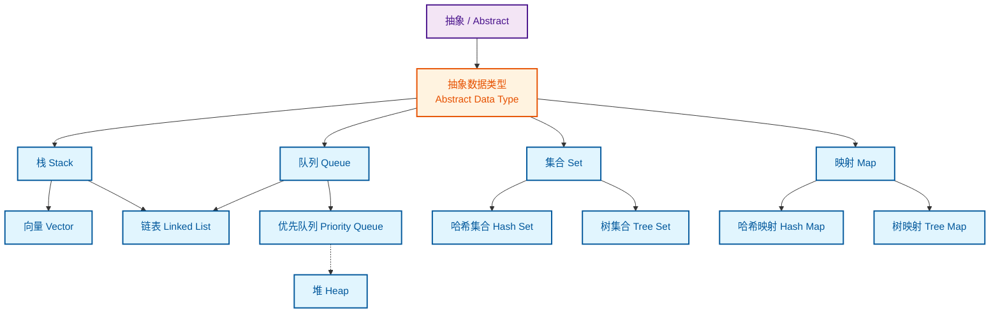

## ß

- 打乱知识点
- 刻意练习
- 反馈和调整
    - 主动行反馈
    - 被动型反馈
    

### 数据结构的关系

```mermaid

graph TD
    %% 定义样式，使矩形节点更清晰
    classDef defaultNode fill:#e1f5fe,stroke:#01579b,stroke-width:2px,color:#01579b
    classDef abstractNode fill:#f3e5f5,stroke:#4a148c,stroke-width:2px,color:#4a148c
    classDef adtNode fill:#fff3e0,stroke:#e65100,stroke-width:2px,color:#e65100
    
    %% 第一层：核心概念
    Abstract[抽象 / Abstract]:::abstractNode
    ADT[抽象数据类型<br/>Abstract Data Type]:::adtNode
    
    Abstract --> ADT

    %% 第二层：基本ADT
    Stack[栈 Stack]:::defaultNode
    Queue[队列 Queue]:::defaultNode
    Set[集合 Set]:::defaultNode
    Map[映射 Map]:::defaultNode
    
    ADT --> Stack
    ADT --> Queue
    ADT --> Set
    ADT --> Map

    %% 第三层：具体实现或变体
    %% 栈的实现
    Vector[向量 Vector]:::defaultNode
    LinkedList[链表 Linked List]:::defaultNode
    
    Stack --> Vector
    Stack --> LinkedList
    
    %% 队列的变体
    PriorityQueue[优先队列 Priority Queue]:::defaultNode
    Queue --> LinkedList
    Queue --> PriorityQueue
    
    %% 集合的实现
    HashSet[哈希集合 Hash Set]:::defaultNode
    TreeSet[树集合 Tree Set]:::defaultNode
    
    Set --> HashSet
    Set --> TreeSet
    
    %% 映射的实现
    HashMap[哈希映射 Hash Map]:::defaultNode
    TreeMap[树映射 Tree Map]:::defaultNode
    
    Map --> HashMap
    Map --> TreeMap
    
    %% 特殊关系：堆（通常由优先队列使用）
    Heap[堆 Heap]:::defaultNode
    PriorityQueue -.-> Heap
```

### 数据结构

### 算法

